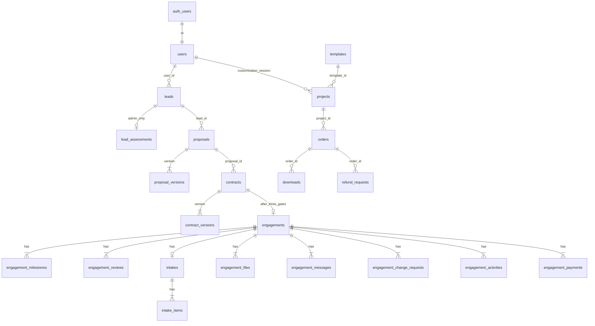

# Domain and Data Model Decisions

Step 9에서 확정한 모델이다. 테이블은 아직 만들지 않았다. 공식 대상 `qzvxypynlluqpdpmsstu`의 public schema는 비어 있다.

상태 값은 기존 migration처럼 PostgreSQL enum이 아니라 `text`와 `CHECK`로 둔다. 금액은 원 단위 `integer`다. `float`는 쓰지 않는다.

## Legacy와 New의 경계

Legacy는 템플릿 판매다. New Studio는 의뢰와 제작이다.

`public.projects`는 템플릿 세션이다. `engagements`와 외래 키로 연결하지 않는다.

`orders.project_id`는 계속 필수다. Studio 결제는 `engagement_payments`다.

## 신원

별도 `customers` 테이블은 없다.

`public.users`가 계정이다. `id`는 `auth.users.id`다.

| 필드 | 결정 |
|------|------|
| email, name | 유지 |
| account_type | `individual` 또는 `business`. 기존 행은 NULL 허용 |
| company_name | business일 때만 |
| is_admin | account_type과 무관. 트리거로 일반 UPDATE에서 보호 |
| created_at | 있음 |
| updated_at | 001에는 없다. 나중에 additive migration으로 추가 |

Guest Lead는 `leads.user_id`가 NULL이다. 가입 후 연결은 `handle_new_user`에서 하지 않는다. 가입이 끝난 뒤 서비스가, 인증된 이메일이 같고 아직 다른 계정에 붙지 않은 Lead에만 `user_id`를 채운다. 이미 다른 사용자에게 연결된 Lead는 덮어쓰지 않는다.

OAuth 직후 `created_at`이 15분 이내인지를 보는 분기는 최종 구조에서 제거한다. 계정 유형이 없으면 계정 유형 화면으로 보낸다. 이번 Step에서는 코드는 고치지 않는다.

## 상태와 JSON

검색, 관계, 상태에 쓰는 값은 컬럼이다. JSONB는 문서 스냅샷에만 쓴다.

- Proposal 버전 본문
- Contract 버전 본문
- Legacy `projects.input_data`, `custom_params`, `templates.variables`

Lead의 목표, 대상, 기능은 `text[]`다. 참고 링크는 `{url, note}[]`라서 `jsonb`다.

고객이 보면 안 되는 문장은 같은 행의 JSON에 넣지 않는다. 행 단위 RLS로 숨길 수 없기 때문이다. 내부 평가는 `lead_assessments`로 분리한다. Proposal 내부 메모는 `proposal_versions`의 공개 `content`와 분리된 `internal_notes`를 관리자 전용 뷰 또는 별도 행 정책으로 막는다. 구현 시 고객 역할에는 `internal_notes` 컬럼 SELECT를 주지 않는다.

## 삭제와 보존

| 대상 | 방향 |
|------|------|
| contracts, contract_versions | 유지. 상태만 변경 |
| proposals, proposal_versions | 유지. 버전 삭제 없음 |
| engagement_payments, orders, refund_requests | 유지 |
| engagement_activities | 추가만 |
| engagements | 취소 상태. 물리 삭제는 하지 않음 |
| projects | 기존처럼 `deleted_at` |
| leads | 유지. `LOST`로 닫음 |

## MVP에 넣는 테이블

### Group A — Legacy baseline

빈 데이터베이스에서 현재 Commerce 코드가 요구하는 것들이다. `001`–`020`을 순서대로 재사용하는 범위다.

- users
- templates, templates_public
- projects
- orders
- downloads
- faqs
- inquiries
- chatbot_inquiries
- policy_agreements
- refund_requests

Storage 버킷 `project-uploads`, `project-outputs`, `thumbnails`는 SQL에 생성문이 없다. `refund-attachments`만 `019`에 있다. 버킷 생성은 나중 Storage 단계다.

### Group B — Studio MVP

- leads
- lead_assessments
- proposals
- proposal_versions
- contracts
- contract_versions
- engagements
- engagement_milestones
- engagement_reviews
- intakes
- intake_items
- engagement_files
- engagement_messages
- engagement_change_requests
- engagement_activities
- engagement_payments

### Group C — 나중

- products
- care_subscriptions와 Care 정책 필드
- support_tickets
- organizations, workspaces, workspace_members, subscriptions

`products.legacy_template_id`는 나중에 `templates.id`를 가리킬 수 있다. `templates`를 지우거나 이름을 바꾸지 않는다.

Products, Care, SaaS, Support 티켓은 운영 정책이나 통합 범위가 비어 있으므로 첫 migration에 넣지 않는다.

## Lead

`leads`는 고객이 자신의 의뢰를 볼 수 있는 필드만 둔다.

id, user_id nullable, name, email, phone, company, account_type, project_type, current_status, goals text[], target_users text[], features text[], description, timeline, budget, reference_urls jsonb, status, source, created_at, updated_at.

상태: `NEW`, `CONTACTED`, `CONSULTATION`, `PROPOSAL`, `WON`, `LOST`.

`lead_assessments`는 관리자 전용이다. lead_id, qualification, recommended_path, internal_notes, updated_at.

`recommended_path`는 코드와 같이 Ready, Ready + Custom, Full Custom Website, MVP / Product, Not Fit.

## Proposal

`proposals`: id, lead_id, user_id nullable, status, current_version, valid_until, created_at, updated_at.

`proposal_versions`: id, proposal_id, version, content jsonb, internal_notes text, subtotal integer, vat integer, total integer, created_at.

`content`에는 summary, goals, scope, out_of_scope, deliverables, timeline, line_items, payment_schedule, revision, support가 들어간다. `internal_notes`는 content 밖에 둔다.

상태: `DRAFT`, `SENT`, `VIEWED`, `REVISION_REQUESTED`, `APPROVED`, `REJECTED`, `EXPIRED`.

고객에게 Draft는 보이지 않는다. 현재 버전 번호를 덮어써서 과거 본문을 지우지 않는다.

## Contract

`contracts`: id, proposal_id, user_id nullable, status, current_version, created_at, updated_at.

`contract_versions`: id, contract_id, version, content jsonb, created_at.

동의 기록은 `contracts`에 둔다. agreed_by, agreed_at, agreed_ip, agreed_version. 전자서명 구현은 없다.

상태: `DRAFT`, `SENT`, `VIEWED`, `AGREED`, `DECLINED`, `EXPIRED`.

## Engagement 생성

조건은 Proposal `APPROVED`, Contract `AGREED`, 해당 계약의 Deposit `PAID`다.

데이터베이스 CHECK 한 줄로는 세 테이블을 막기 어렵다. 클라이언트 INSERT도 허용하지 않는다.

최종 Integration에서는 서비스 롤이 한 트랜잭션으로 호출하는 함수가 조건을 확인하고, 그 계약에 Engagement가 없을 때만 행을 만든다. 함수 이름 후보는 `create_engagement_from_contract`. 이번 Step에서는 만들지 않는다.

## Engagement

id, user_id, lead_id, proposal_id, contract_id, name, project_type, status, progress_stage, progress integer, started_at, expected_completion, action_kind nullable, action_due_date nullable, blocked_reason nullable, current_milestone_id nullable, created_at, updated_at.

관리자 상태는 코드의 16개와 같다. `DRAFT`부터 `CANCELLED`까지.

`progress_stage`는 저장값이다. 고객에게 보여줄 단계는 계산값이다. `PAUSED`와 `CANCELLED`가 아니면 관리자 상태에서 준비, 기획, 디자인, 제작, 검토, 완료로 줄인다. 중지와 취소면 저장된 `progress_stage`를 그대로 쓴다. `customerStageFor`와 `resolveCustomerStage`와 같다.

`action_kind`는 저장값이다. 화면 문구는 코드에서 만든다. 종류는 `CONTENT_REQUIRED`, `REVIEW_REQUIRED`, `APPROVAL_REQUIRED`, `PAYMENT_REQUIRED`, `CHANGE_REQUEST_APPROVAL`, `INFORMATION_REQUIRED`. NULL이면 없음. 할 일 테이블은 만들지 않는다.

## Milestone

`engagement_milestones`: id, engagement_id, title, description, status, position integer, due_date, completed_at, requires_approval, created_at, updated_at.

상태: `NOT_STARTED`, `IN_PROGRESS`, `AWAITING_REVIEW`, `REVISION`, `APPROVED`, `COMPLETED`, `BLOCKED`.

단계 잠금은 별도 테이블이 아니다. Review가 `APPROVED`가 되면 해당 마일스톤 상태도 `APPROVED`다. 그 이후의 범위 변경은 Change Request다. 강제 위치는 위와 같은 서비스 함수다.

## Intake

`intakes`는 Engagement당 하나다. id, engagement_id unique, status, created_at, updated_at.

상태: `NOT_STARTED`, `IN_PROGRESS`, `AWAITING_REVIEW`, `NEEDS_REVISION`, `COMPLETED`.

`intake_items`: id, intake_id, category, title, description, required, status, customer_response, reference_url, admin_feedback, created_at, updated_at.

항목 상태: `NOT_STARTED`, `UPLOADED`, `UNDER_REVIEW`, `NEEDS_REVISION`, `APPROVED`, `OPTIONAL`.

Ready to Start는 계약 동의, 계약금 지급, Intake 행이 있을 것, 그리고 필수 항목이 모두 `APPROVED`일 것이다. 필수 항목이 0개면 마지막 조건은 참이다. Intake 행이 없으면 거짓이다.

비밀 값 입력란은 없다.

## Review

`engagement_reviews`: id, engagement_id, milestone_id, title, status, requested_at, reviewed_at, feedback, version integer, created_at.

상태: `PENDING`, `APPROVED`, `REVISION_REQUESTED`.

## Change Request

id, engagement_id, title, description, classification, status, cost_impact, schedule_impact, audience, created_at, approved_at, updated_at.

분류: `SCOPE_IN`, `MINOR_CHANGE`, `CHANGE_REQUEST`, `BUG`.

상태: `DRAFT`, `UNDER_REVIEW`, `AWAITING_CUSTOMER_APPROVAL`, `APPROVED`, `REJECTED`, `IN_PROGRESS`, `COMPLETED`.

고객 SELECT는 `audience = customer`이고 상태가 고객용 다섯 값인 행만 허용한다.

## Files, Messages, Activities

`engagement_files`: id, engagement_id, name, storage_path, category, uploaded_by, audience, version, created_at.

audience는 `customer` 또는 `admin`. 버킷은 나중에 `engagement-files`. 경로는 `{engagement_id}/{category}/{file_id}`.

`engagement_messages`: id, engagement_id, sender_user_id, body, is_internal, created_at.

고객 SELECT는 `is_internal = false`만.

`engagement_activities`: id, engagement_id, type, actor_user_id nullable, actor_label, description, audience, created_at.

유형: `STATUS_CHANGED`, `MILESTONE_UPDATED`, `REVIEW_REQUESTED`, `APPROVED`, `FILE_ADDED`, `CHANGE_REQUEST_CREATED`, `PAYMENT_UPDATED`.

고객 SELECT는 `audience = customer`만.

## Studio Payment

`engagement_payments`: id, engagement_id, type, amount integer, due_date, paid_at, status, payment_reference, created_at.

type: `DEPOSIT`, `INTERIM`, `FINAL`.

status: `PENDING`, `PAID`, `FAILED`, `OVERDUE`, `REFUNDED`, `PARTIAL_REFUND`, `CANCELLED`.

`orders`와 합치지 않는다. PortOne 연동은 나중이다.

## Support와 Product

기존 `inquiries.status`의 `pending`, `replied`와 Contact가 넣는 `new`는 그대로 둔다. 새 Support 상태 `NEW`, `OPEN`, `WAITING_CUSTOMER`, `RESOLVED`, `CLOSED`와 같다고 보지 않는다.

`support_tickets`는 Group C다. 만들 때 매퍼를 따로 둔다.

`products`도 Group C다. 종류 READY, APX, BRAND, CARE, SAAS. 상태 DRAFT, ACTIVE, HIDDEN, ARCHIVED. `legacy_template_id`는 nullable.

## 관계

Studio 쪽과 Legacy 쪽은 사용자 계정만 공유한다. `projects`와 `engagements`는 연결하지 않는다.

## 고객에게 숨기는 것

RLS로 막을 대상이다. 화면 mapper만으로 충분하지 않다.

- lead_assessments 전체
- proposal version internal_notes
- is_internal 메시지
- audience admin 파일과 활동
- audience admin 이거나 상태가 DRAFT, UNDER_REVIEW인 변경 요청
- Draft proposal, Draft contract

## RLS 초안

적용하지 않는다. 서비스 롤은 서버 함수에서만 쓰고, 브라우저에 키를 두지 않는다.

표의 기호는 Select, Insert, Update, Delete다. `-`는 없음이다.

| 테이블 | Guest | 로그인 고객 | 소유자 | Admin | Service role |
|--------|-------|-------------|--------|-------|--------------|
| users | - | S 본인, U 본인. is_admin 변경 불가 | 같음 | S 전체. is_admin은 보호 트리거 | 계정 생성 트리거 |
| templates | 뷰만 S | 뷰만 S | 뷰만 S | RPC | 템플릿 원본 |
| projects | - | - | S I U 본인. D 없음 | S | customize, payment |
| orders | - | - | S 본인. I U 없음 | S U | I U 결제, 환불 |
| downloads | - | - | S 본인 주문 | S | I |
| inquiries | - | - | S 본인 user_id | S U D | I guest contact |
| chatbot_inquiries | - | - | - | S | I |
| refund_requests | - | - | S I 본인 | S U | U 처리 |
| leads | - | - | S 본인. I는 서버 | S U | I guest request |
| lead_assessments | - | - | - | S U | U |
| proposals, versions | - | - | S 공개 필드, Draft 제외 | S U | I U |
| contracts, versions | - | - | S 본인, Draft 제외 | S U | I U 동의 기록 |
| engagements와 자식 | - | - | S 고객 공개 행만 | S U | I 생성 함수 |
| engagement_payments | - | - | S 본인 | S U | U 결제 |
| Group C | 없음 | 없음 | 없음 | 없음 | 아직 테이블 없음 |

소유자의 Engagement SELECT 조건은 자식 테이블마다 다르다. 메시지, 파일, 활동, 변경 요청은 위의 고객 공개 조건을 정책에 넣는다.

## Migration 순서 초안

파일을 만들지 않는다. `001`–`020`은 수정하지 않는다. 보완은 나중에 `021` 이후로만 한다.

1. Legacy baseline. `001`–`020`을 빈 데이터베이스에 순서대로 재사용한다.
2. Account 보완. `users.updated_at`처럼 빈칸만 additive로 추가한다.
3. Studio 영업. leads, assessments, proposals, contracts.
4. Studio 제작. engagements와 자식, intake, payments.
5. RLS.
6. Storage 버킷과 정책. Commerce 버킷 3개와 `engagement-files`.
7. Edge Functions.
8. 관리자 계정과 필요한 시드.
9. 런타임 연결과 기존 사이트 env 전환. 별도 지시 전 하지 않는다.

`003`은 정책만 있고 Commerce 버킷 생성은 없다. 그래서 6번이 필요하다. `003` 파일은 고치지 않는다.
